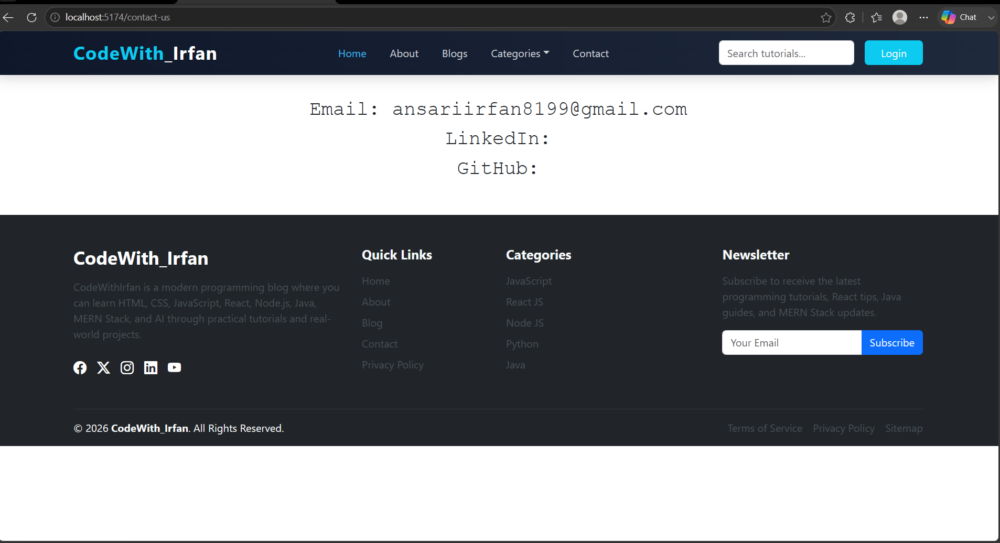

# 🚀 CodeWith_Irfan Blog

CodeWith_Irfan Blog is a modern programming platform built with React.js, Bootstrap 5, and React Router DOM to share programming tutorials, web development concepts, and real-world projects.

## ✨ Features

- Responsive Navigation Bar
- Professional Footer
- React Router DOM Navigation
- Reusable React Components
- Bootstrap 5 UI
- Single Page Application (SPA)
  
## 🛠️ Tech Stack

- React.js
- Vite
- Bootstrap 5
- React Router DOM
- JavaScript (ES6+)
- HTML5
- CSS3

## 📸 Project Preview

## 👨‍💻 Author

**Irfan Ansari**

GitHub: https://github.com/IrfanAnsari73
